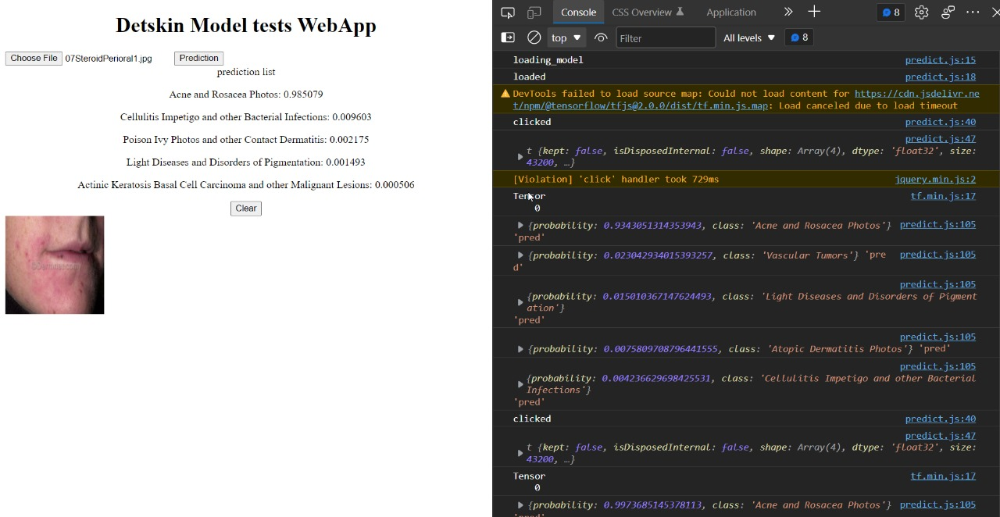

# Task -2 
This is detailed documnetation of the workflow of the creation of application for typhoid using Deep-Learning Algorithms.

## Table of Contents

0. [Problem statement](#problem-statement) 
1. [Abstract](#Abstract)
2. [Technologies](#technologies)
3. [workflow](#workflow)
4. [Demo](#Demo)
<!-- 5. [Improvement in algorithm](#Improvement) -->
5. [About](#About)

### Problem-statement: 
***

According to WHO the global typhoid fever disease burden at 11-20 million cases annually, which leads to 128,000–161,000 deaths per year.
And most of the deaths are due to late recognitions of it and inncorret precautions.

We would like to combine AI(Deeplearning models) which will help the humans in faster diagnosis.

Proposed Solution

• The idea is to develop an cross platform application(Which has only one codebase and multiple applicatios can be exported to any form) and use the latest tech and computational power of the devices that we have and reduce human efforts.

<!-- ### Screenshot
 -->

### Abstract:
As the problem statement mentioned above. So the main moto is to make the process of diagnosis faster , effective and effiecient.

Now the problem is divided into two parts:
* **To predict the state of typhoid in the patient using the current status and symtoms of 	the the user.**
* **A medium which is easily accesible for the user to test. Which is user friendly and easy to access.**
  
  ### Soultion for Problem-1
  
  Here we use two types of models:

  **First one** is a classifier using the categorigal data which we take the inputs from the 		user regarding his symptoms	in the form of quiz,form or survey.
  The model could be any of the classsifier.
  Such as Decision tree,logistic regressor, radom forest classifier, XGBoost or a neural  		network
  
  **Second one** is a image classifier which takes the blood sample image array as input 	and pass it to the classifier.
  We take the image from the gallery or camera.
  
  ### Solution for problem-2
  
  The solution for this problem is to build a application which can be used be used by the user with ease.
  
  **Approach-1 **
  We can build an application for each type of device such as android, ios, web etc....
  seperately.
 ** Approach-2** 
  We can build a cross-platform application using react. Which help us in having only single codebase and export the application for whatever device we want.

## Technologies
***
A list of technologies used within the project:
* [Tensorflow/Pytorch](https://example.com)
* [React](https://example.com)
* [Python](https://example.com)
* [etc ....](https://example.com)

## Workflow
**Step-1**
Collect the typhoid related categorical data of symtoms and train a classifier model.

**Step-2**
Collect the images of the blood samples related to typhoid and train the image classifier on it.

**Step-3**
Ensemble both the models and aquire the results.

**Step-4**
Build the basic structure of the application.

**Step-5**
integrate the model into the application and get the valid outputs. And share the data with the organisation and cosult the doctors.

## Demo:
The following are the basic demo implemetations of the application.

This is a simple classifier of categorical data:
Github : https://github.com/Captain272/Crop-prediction-For-your-soil-type

Video Link: https://www.youtube.com/watch?v=5SnHHs-Y0Z0

Simple Image classifier:

The demo application template:

https://user-images.githubusercontent.com/61205382/164287389-a988583f-561b-4cce-981a-f5ae37d8677c.mp4

## About
***
This is my

LinkedIn profile : https://www.linkedin.com/in/lopinti-abhijeeth-90942b178/

Kaggle : https://www.kaggle.com/captainabhijeeth

## Tech Stack

**Language :** C,C++,Java,Python,ts etc...

**Packages :** Numpy,Pandas,Matplotlib,openCv etc